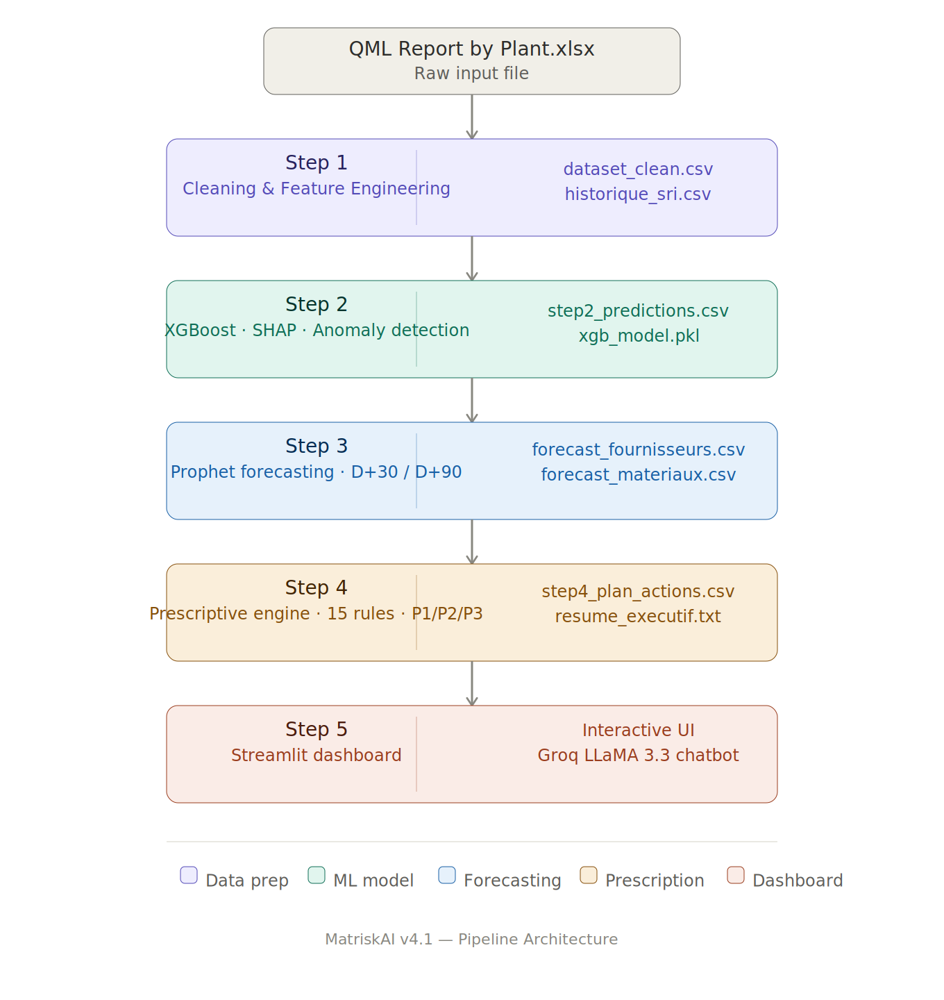
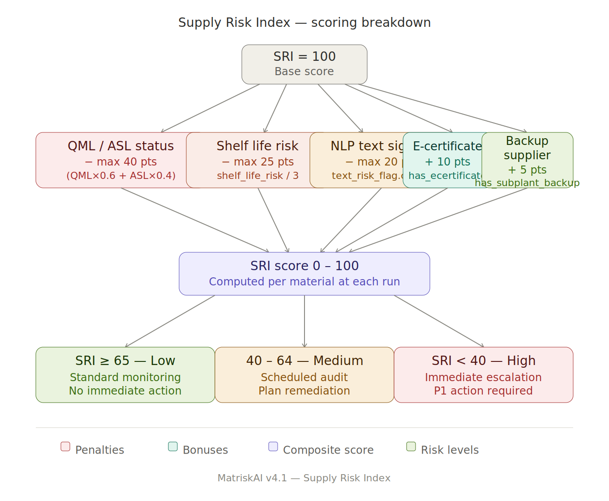
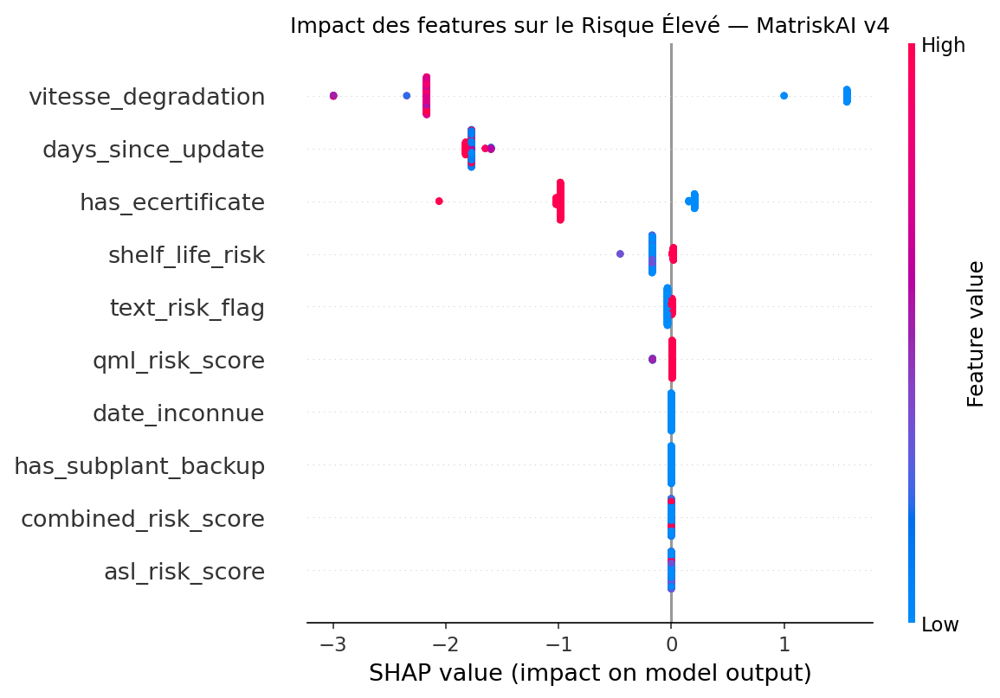

<div align="center">
  
  
  <h1>MatriskAI</h1>
  <p><strong>AI-Powered Supply Chain Risk Intelligence Platform</strong></p>

  <!-- Badges -->
  <p>
    
    
    
    
    
    
  </p>
  
  <p>
    <em>End-to-End AI System for Supply Chain Risk Detection, Forecasting, and Prescription</em>
  </p>
  
  <p>
    <b>Dataset :</b> 1978 matériaux | 50 colonnes &nbsp;&nbsp;•&nbsp;&nbsp; <b>Dernière exécution :</b> 2026-05-24
  </p>
</div>

---

## 🎥 Demo Video

[](https://github.com/intissarlayad/MatriskAI/releases/download/v1.0/video_Demo.mp4)

---

## 📑 Table of Contents

1. [Vue d'ensemble](#-vue-densemble)
2. [AI Solution](#-ai-solution)
3. [Project Architecture](#-project-architecture)
4. [Dataset & Features](#-dataset--features)
5. [Pipeline (Les 4 Étapes)](#-pipeline--les-4-étapes)
6. [Results & Metrics](#-results--metrics)
7. [Screenshots](#-screenshots)
8. [Getting Started & Déploiement](#-getting-started--déploiement)
9. [Exécution & Maintenance](#-exécution--maintenance)
10. [Problèmes Connus & Limitations](#-problèmes-connus--limitations)
11. [Roadmap](#-roadmap)
12. [Team & Contact](#-team--contact)

---

## 🛑 Vue d'ensemble

Les chaînes d'approvisionnement (Supply Chains) souffrent de perturbations majeures causées par des défaillances de fournisseurs et des retards logistiques. Gérer ces risques complexes via des rapports Excel statiques (comme les QML/ASL Reports) est extrêmement propice aux erreurs, chronophage et fondamentalement réactif.

**MatriskAI** est un pipeline de data science en 4 étapes conçu pour évaluer, prédire et prescrire des actions sur les risques liés aux matériaux industriels, en combinant machine learning, séries temporelles et un moteur de règles prescriptives.

---

## 💡 AI Solution

**Ce que fait l'IA :** Le système ingère les historiques de qualité fournisseurs, génère un Supply Risk Index (SRI), classifie les anomalies (Faible / Moyen / Élevé), et prévoit la dégradation des fournisseurs (J+90).
**Pourquoi c'est innovant :** L'approche intègre l'analyse prédictive (XGBoost), l'explicabilité (SHAP), les séries temporelles bayésiennes (Prophet), et un système expert local, sans nécessiter d'infrastructures cloud lourdes.

---

## 🏗 Project Architecture

L'architecture est structurée autour d'un pipeline MLOps robuste :



---

## 📊 Dataset & Features

Le dataset en entrée (`QML report by Plant.xlsx`) contient 1978 lignes et 50 colonnes. Le pipeline d'ingénierie (Step 1) extrait et calcule **13 features** exploitables :

| Feature | Description | Exemple |
|---|---|---|
| `qml_risk_score` | Statut QML encodé (0=Certified → 4=Disqualified) | 3 |
| `asl_risk_score` | Statut ASL encodé | 4 |
| `combined_risk_score` | Score combiné : 60% QML + 40% ASL | 3.4 |
| `days_since_update` | Jours depuis la dernière mise à jour | 794 |
| `date_inconnue` | Flag : date de mise à jour manquante | 0 |
| `vitesse_degradation` | Vitesse de dégradation du SRI (calculée sur historique réel) | variable |
| `shelf_life_risk` | Niveau de risque shelf life (0=OK >12m ... 3=<3m) | 1 |
| `has_ecertificate` | Présence d'un e-Certificate | 1 |
| `has_subplant_backup` | Présence d'un backup sous-usine | 0 |
| `text_risk_flag` | Score NLP sur les mots-clés de risque | 3 |
| `score_confiance` | Score de confiance heuristique (0–100) | 75 |
| `SRI` | Supplier Risk Index global calculé (0–100, 100=sûr) | 47.7 |
| `risk_label` | Label final déduit (Faible / Moyen / Élevé) | Moyen |

---

## 🧠 Pipeline : Les 4 Étapes

### Étape 1 — Feature Engineering + Historique
- **Objectif :** Transformer le brut en signaux ML, et sauvegarder un snapshot daté.
- **Statistiques :** Majorité de matériaux "Obsolete" (81.4%). Label "Élevé" (2.2% des cas).

### Étape 2 — XGBoost + Calibration + Anomalies
- **Objectif :** Classificateur XGBoost (Faible/Moyen/Élevé) avec détection d'anomalies `IsolationForest` (99 anomalies détectées, soit 5.0% du dataset).
- **Features clés :** Utilise 10 des 13 features calculées. Le modèle brut XGBoost est robuste avec une excellente précision globale.

### Étape 3 — Time Series + Prophet
- **Objectif :** Projection temporelle J+30 / J+90 des SRI par fournisseur.
- **Dynamique :** Analyse de **76 fournisseurs**. Utilise Prophet pour 58 d'entre eux, avec un repli (fallback) linéaire automatique pour les 18 restants (manque de données).

### Étape 4 — Moteur Prescriptif
- **Objectif :** 15 règles métiers appliquées pour créer un plan d'action.
- **Résultat :** **653 actions recommandées** couvrant 150 matériaux problématiques. Réparties en *Requalification, Stock, Prévention, Alternative*.

---

## 📈 Results & Metrics

Voici les métriques exactes issues du dernier cycle d'évaluation :

| Metric | Score / Détail |
| :--- | :--- |
| **Précision XGBoost Test Set** | **88.8%** |
| **F1-Score (CV 5-fold)** | **0.996 ± 0.003** |
| **Alertes Fournisseurs J+90** | 🔴 7 URGENT | 🟡 13 ATTENTION | 🟢 56 OK |
| **Confiance Finale (XGBoost)** | 85.1 – 86.3 / 100 |

> ℹ️ *Note : Le modèle performe exceptionnellement bien sur la classe "Faible" mais requiert des techniques de rééchantillonnage pour la classe très minoritaire "Élevé" (Seulement 44 matériaux).*

---

## 📸 Screenshots

### 🔹 SRI global


### 🔹 Explainable AI (SHAP Analysis)


---

## 🚀 Getting Started & Déploiement

### Prérequis & Installation
- Python 3.9+
- `prophet` (optionnel mais fortement recommandé pour l'étape 3)

```bash
git clone https://github.com/intissarlayad/MatriskAI.git
cd MatriskAI

pip install -r requirements.txt
pip install prophet 
```

### Usage
```bash
# Lancer le pipeline complet
python run_pipeline.py

# Démarrer le Dashboard interactif
streamlit run Scripts/matrisk_step5_dashboard.py
```

### 🐳 Déploiement Docker
```bash
docker build -t matrisk-ai .
docker run -p 8501:8501 matrisk-ai
```

---

## 🗓 Exécution & Maintenance

**Fréquence d'exécution recommandée : Mensuelle**

L'ordre canonique pour une mise à jour mensuelle de vos données est :
`matrisk_step1_features.py` ➔ `matrisk_step2_train.py` ➔ `matrisk_step3_forecast.py` ➔ `matrisk_step4_prescriptif.py`

*Note Importante : Prophet s'active automatiquement et devient performant à partir du 4ème snapshot mensuel.*

---

## ⚠️ Problèmes Connus & Limitations

Ce projet est transparent sur ses limites actuelles :
*   **`vitesse_degradation` aberrante** : Si vous exécutez le pipeline depuis des dossiers de travail différents, la lecture des anciens snapshots produit des valeurs aberrantes. *Solution : Toujours exécuter depuis le même répertoire racine.*
*   **Calibration isotonique échoue** : La classe `Élevé` est trop rare (parfois 1 seul exemple dans le fold). *Impact faible : le modèle brut XGBoost de secours prend le relais avec succès.*
*   **Double snapshot le même jour** : Si Step 1 est relancé deux fois le même jour, l'historique doublonne. *Solution : Supprimez la ligne manuellement dans `historique_sri.csv` en cas d'erreur de manipulation.*
*   **Erreur d'initialisation Stan (Prophet)** : Survient si vous n'avez qu'un seul snapshot de données. *Comportement : Le système passe automatiquement au modèle Linéaire, sans crasher.*

---

## 🗺 Roadmap

Les futures évolutions (Mises à jour MLOps) :

- [ ] Normaliser `vitesse_degradation` pour gérer les valeurs aberrantes (capping percentile).
- [ ] Ajouter un rééchantillonnage de type SMOTE ou `class_weight` pour optimiser la sensibilité (Recall) de la classe minoritaire `Élevé`.
- [ ] Implémenter une stratégie de calibration (`prefit`) adaptée aux classes rares.
- [ ] Automatisation CI/CD : Exécution mensuelle via cron job ou task scheduler.
- [ ] Export automatique natif du `step4_plan_actions.csv` vers les systèmes ERP (SAP, Oracle).
- [ ] Dashboard avancé : Visualisation enrichie des alertes fournisseurs (Streamlit ou intégration Power BI).

---


## 🤝 Contributing

Les contributions sont vivement encouragées pour améliorer ce projet IA ! Consultez le fichier `CONTRIBUTING.md`.
Veuillez utiliser les standards **Conventional Commits** :
```text
feat: add AI prediction module
fix: resolve dashboard loading issue
docs: update README architecture
```

---
## 👨‍💻 Team & Contact

*   **[Intissar LAYAD]** - *AI Engineer & Data Scientist*
    *   [LinkedIn](linkedin.com/in/intissar-layad-07444b377)

    **[Aya IDHAMOUCH]** - *AI Engineer & Data Scientist*
    *   [LinkedIn](https://www.linkedin.com/in/aya-idhamouch-22a996319)

Pour toute demande académique, d'investissement ou partenariat technique, n'hésitez pas à ouvrir une Issue ou à me contacter directement.

---
<div align="center">
  <sub>Built with ❤️ for AI Supply Chain Intelligence. Distributed under the MIT License.</sub>
</div>